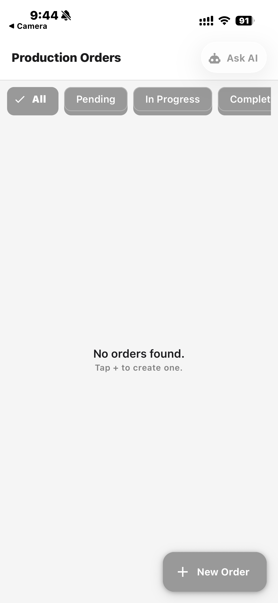
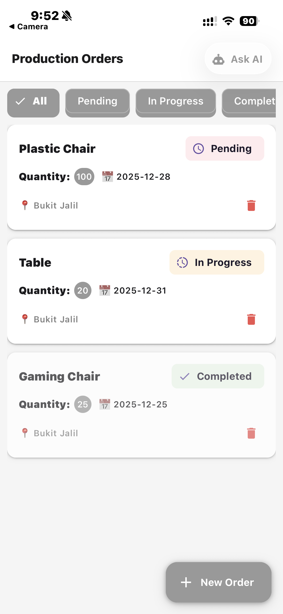
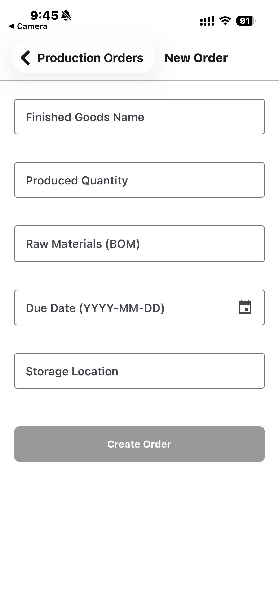
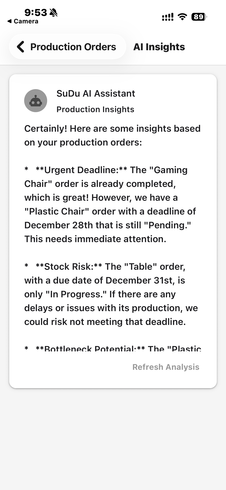

# Production Order Management App (SuDu AI Pre-Task)

Check out the [Live Demo](https://expo.dev/preview/update?message=Initial+Demo&updateRuntimeVersion=1.0.0&createdAt=2025-12-16T13%3A33%3A47.594Z&slug=exp&projectId=1f2040d9-d6b9-4e67-9cd2-5139afe83ab3&group=3391c3e0-f1cf-431e-9957-73724813d000) here.

A mobile application built with React Native (Expo) to manage Production Orders, featuring local SQLite storage and an AI assistant simulation.

## Features
- **Dashboard**: Show all the orders, Filter by using status
- **Filtering**: Filter orders by using 'All', 'Pending', 'In Progress', and 'Completed'
- **Create Order**: Form with validation
- **Local Database**: Using expo-sqlite to store the orders
- **AI Assistant**: Integrate with Google Gemini API to provide insights

## 1. Setup Instructions
1. Clone the repository.
    ```bash
    git clone https://github.com/dylanc0214/ProductionOrderApp
    cd POManager
2. Install dependencies:
    ```bash
    npm install
3. Run the program:
    ```bash
    npx expo start
    ```

## 2. Technical Notes
### Architecture
- **src/screens/**: Contains all main UI screens (Dashboard, CreatePO, AI Assistant).
- **src/database/**: Handles SQLite initialization and direct CRUD operations.
*(Note: I kept the code inside the screens files instead of creating extra folders like `components` or `types`. This makes the project easier to navigate since it is a small app.)*

### Challenges & Assumptions
#### Challenges
- Faced a compatibility issue with `react-native-screens` which required a version downgrade.
- Google Gemini API `gemini-pro` and `1.5-flash` models returned errors; solved by switching to the newer `gemini-2.5-flash-lite`.
##### Assumptions
- The API Key is hardcoded for demo purposes (in a real app, this would be in `.env`).
- Dates are handled as simple strings (YYYY-MM-DD) without install any library

## 3. AI Usage Log
I used AI tools (Gemini and Jules) to assist in the development process. Below is the log of key prompts and how the output was applied.
| Prompt | AI Response Summary | How I Applied It |
| :--- | :--- | :--- |
| Best folder structure for React Native Expo app with TypeScript | Suggested using a `src` directory with separation between screens, components, services, and types | Adopted a `src`-based structure to keep UI, logic, and data management clean and scalable |
| Give me the command for install the whole dependencies to setup the environment: I will use React Native, Expo SQLite, React Context, React Native Paper, React Navigation | Provided a combined install command covering navigation, SQLite, UI library, and safe-area dependencies | Used the command to install all required dependencies efficiently in one step |
| Basic App.tsx setup for Expo with React Navigation and React Native Paper | Provided a minimal root component with NavigationContainer, PaperProvider, and SafeAreaProvider | Used the structure as the base of the app and planned to register screens in later phases |
| I met an error called Render Error: Exception in HostFunction: TypeError: expected dynamic type 'boolean', but had type 'string' (I paste the error screenshot adn the App.tsx code) | Provided the fix, explain the error and give me the code | I reviewed the whole code again and found out it is because I used <></> so I pasted it and run it again |
| I keep getting ERROR [Error: Exception in HostFunction: TypeError: expected dynamic type 'boolean', but had type 'string']... | Troubleshoot Expo Go App Launch by downgraded `react-native-screens` from `4.19.0` to `~4.16.0` to resolve a version mismatch | Ran npm install react-native-screens@4.16.0 to revert to a stable version and rebuilt the app. |
| Create a src/database/db.ts file using expo-sqlite. | Provided the code for db.ts including the initDatabase function to create the table if it doesn't exist, using the new synchronous openDatabaseSync API. | Created src/database/db.ts and pasted the schema from Pre-Task Documentation |
| Implement CRUD operations (Create, Read, Update) to db.ts | Generated addProductionOrder, getProductionOrders, and updatePOStatus functions using SQL queries (INSERT, SELECT, UPDATE). | Added these functions to db.ts |
| How do I connect the database in App.tsx | Suggested using the useEffect hook with an empty dependency array [] to run initDatabase() once when the component mounts. | Updated App.tsx to import initDatabase and call it inside useEffect |
| I got a ReferenceError: DashboardScreen is not defined | Identified that DashboardScreen was missing from the file but referenced in the Navigator. Provided the missing component code. | Added the DashboardScreen component definition back into App.tsx to fix the crash. |
| Create a DashboardScreen screen. It needs to fetch all orders from getProductionOrders() and display them in Card Style. | Generated the basic screen structure with useEffect to load data and a renderItem function using Paper's Card component. | Copied the base structure into src/screens/DashboardScreen.tsx. |
| Add a filter bar to filter the list by 'All', 'Pending', 'In Progress', and 'Completed' | Implementing a horizontal list of Chip components for "All", "Pending", "In Progress", and "Completed". Provided the logic to filter the orders array based on the selected chip. | Added the UI with the suggested Filter Chips row. Updated the useEffect hook to react to statusFilter changes. |
| Add a Floating Action Button (FAB) to navigate to the 'CreatePO' screen. | Showed how to use the FAB component from React Native Paper and use navigation.navigate on press. | Added the FAB at the bottom right of the screen. |
| Create a form for Production Orders with fields for Goods, Quantity, Materials, Date, and Location. Include validation. | Generated CreatePOScreen.tsx using TextInput and HelperText. Suggested using KeyboardAvoidingView to prevent the keyboard from blocking inputs. | Copied the component structure. Used useState for form handling and implemented the suggested validation logic. |
| How do I validate a date string YYYY-MM-DD without an external library | Provided a simple Regex: /^\d{4}-\d{2}-\d{2}$/ to check the format. | Applied this regex in the validateDate function |
| When I type a invalid date such as 2025-12-32, it still proceeds and created successfully. | Update the validateDate function to parse the numbers and ensure JavaScript doesn't "auto-correct" invalid dates (like turning Dec 32 into Jan 1). | Pasted the logic into my existing code |
| Implement a mock AI assistant screen I will use Gemini API and here is my key... and give me the full code | Provided code for AIAssistantScreen that fetches data from getProductionOrders(), formats it into a prompt string, and calls the Gemini REST API (gemini-1.5-flash) using fetch. Included loading states and UI. | Created the new screen file with the provided API code. Updated App.tsx navigation and added an "Ask AI" button to the Dashboard header |
| The AI screen says "Sorry, I couldn't analyze...". How do I debug this? | Identified that the generic error message was masking the actual API error response (likely inside result.error). Suggested refactoring the function to check for result.error and log the full JSON response. | Updated AIAssistantScreen.tsx to handle result.error explicitly and display the specific error message (e.g., Invalid API Key) on the UI. | API Error: models/gemini-pro is not found... | Explained that gemini-pro and 1.5-flash are likely deprecated or renamed in the current API version. Recommended using the newer gemini-2.0-flash model. | Found out that the model that AI gave is not exist so I found out replace with a real one |
| How to add push/local notifications for upcoming due dates. | Suggested using expo-notifications. Provided code to request permissions in App.tsx and schedule a notification using Notifications.scheduleNotificationAsync when a new order is created. | Installed the library and integrated the scheduling logic into the handleSave function of CreatePOScreen.tsx, setting the trigger for 9:00 AM on the due date. |
| How to delete the Orders | Provided the DELETE SQL function for db.ts and the UI code to add a trash icon with an Alert confirmation in DashboardScreen.tsx. | Implemented deleteProductionOrder and updated the card UI to include the delete button and logic. |
| How to create live expo demo link (e.g., https://expo.dev/@username/po-manager) | Explained how to do it in my terminal to get that URL https://expo.dev/@username/po-manager | I copy and paste the command into my terminal and set it up |

## Screenshots



